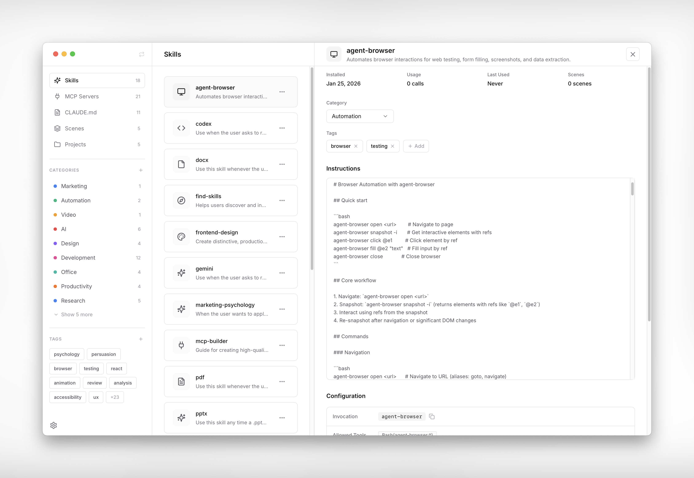
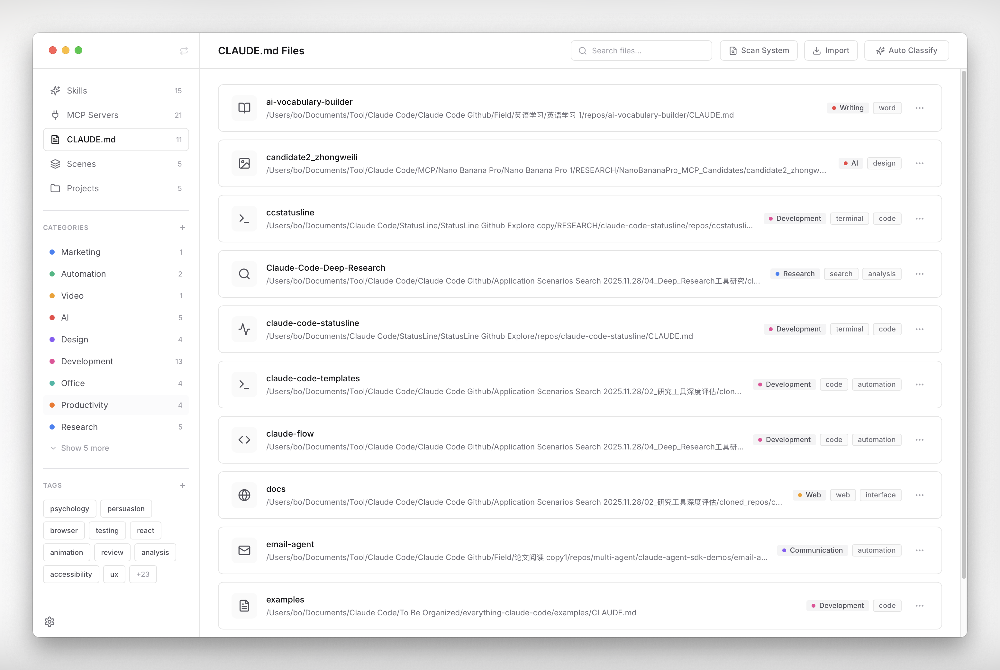
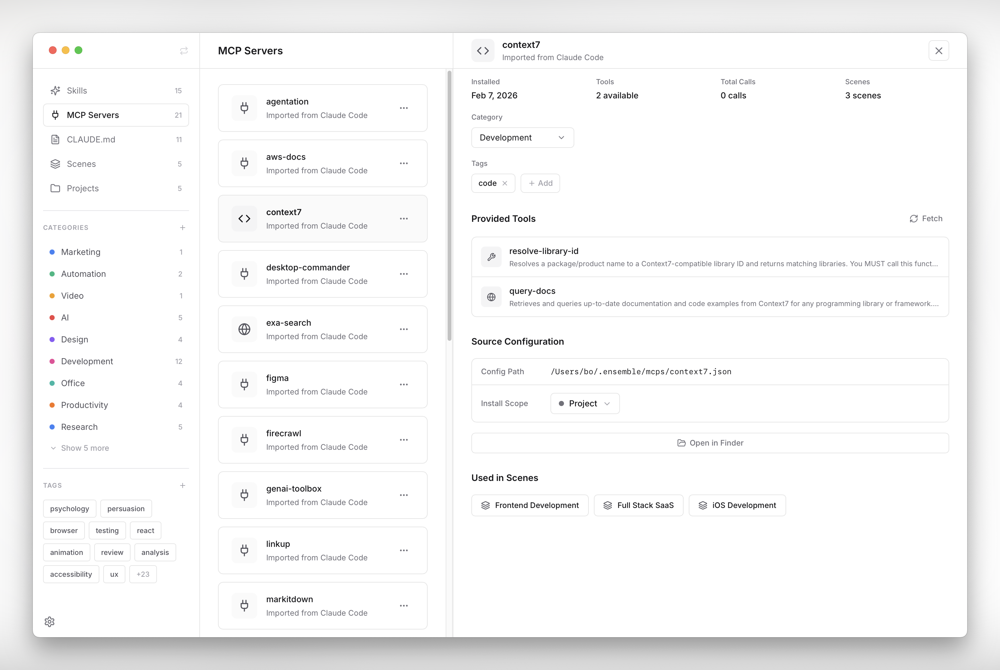
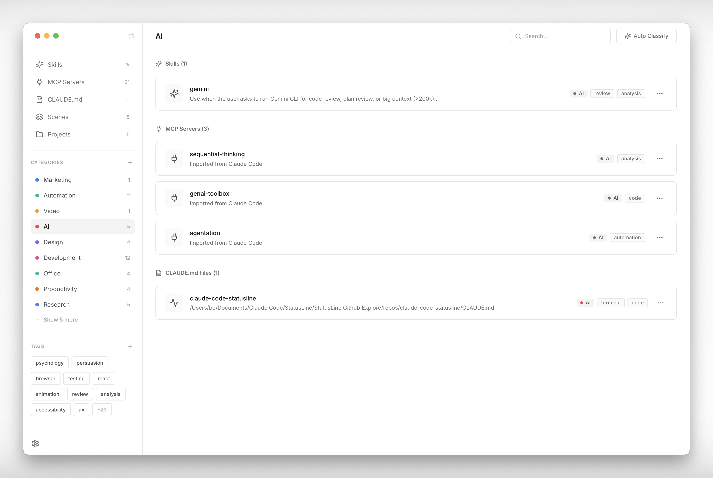

# Ensemble

[](LICENSE)
[](https://github.com/O0000-code/Ensemble/releases)
[](https://github.com/O0000-code/Ensemble/releases)

A macOS desktop application for managing [Claude Code](https://docs.anthropic.com/en/docs/claude-code) configurations -- Skills, MCP Servers, and CLAUDE.md files -- with visual organization, one-click project deployment, and Finder integration.

## Overview

As your collection of Claude Code Skills, MCP Servers, and CLAUDE.md context files grows, managing them through manual file editing becomes tedious and error-prone. Ensemble provides a native macOS interface to organize, bundle, and deploy these configurations to your projects.

Core workflow:

1. **Import** existing configurations from `~/.claude/` and `~/.claude.json`
2. **Organize** with categories and tags (manual or AI-assisted)
3. **Bundle** related items into Scenes
4. **Deploy** Scenes to project folders via symlinks
5. **Launch** Claude Code from Finder with the right configuration



<p align="center">
  <a href="docs/screenshots/claude-md-list.png"></a>
  <a href="docs/screenshots/mcp-detail.png"></a>
  <a href="docs/screenshots/category-filter.png"></a>
</p>

## Features

### Skills Management
- Import existing skills from `~/.claude/skills/`
- Support for plugin-installed skills (from Claude Code marketplace)
- Global or project-level scope control
- Usage statistics tracking from Claude Code logs

### MCP Servers Management
- Import MCP configurations from `~/.claude.json` (both user-scope and project-scope)
- Automatic tool discovery via MCP protocol
- Environment variable management
- Scope control (global/project) with automatic `~/.claude.json` sync

### CLAUDE.md Management
- Scan the filesystem for existing CLAUDE.md, CLAUDE.local.md, and `.claude/CLAUDE.md` files
- Import and centrally manage CLAUDE.md files
- Set a file as global context (`~/.claude/CLAUDE.md`)
- Distribute CLAUDE.md files to project directories
- Configurable distribution path: `.claude/CLAUDE.md`, `CLAUDE.md`, or `CLAUDE.local.md`

### Scenes
- Bundle multiple Skills, MCP Servers, and CLAUDE.md files into reusable configuration sets
- One-click deployment to projects
- Scenes serve as templates for consistent project setup

### Projects
- Associate local project folders with Scenes
- Sync configurations via symlinks (Skills) and `.mcp.json` (MCPs)
- Clear and re-sync configurations as needed

### Organization
- Categories and tags for Skills, MCP Servers, and CLAUDE.md files
- AI-powered auto-classification using the Claude CLI (`claude` command)
- Sidebar filtering by category and tag

### Finder Integration
- "Open with Ensemble" right-click Quick Action for folders in Finder
- Automatically syncs the project's Scene configuration and launches Claude Code
- Configurable terminal: Terminal.app, iTerm2, Warp, or Alacritty
- Customizable launch command

### Trash and Recovery
- Deleted Skills, MCPs, and CLAUDE.md files are moved to trash
- Recover deleted items from Settings

## Installation

### Prerequisites
- macOS 12.0 or later
- [Claude Code](https://docs.anthropic.com/en/docs/claude-code) installed

### Download
Download the latest `.dmg` from the [Releases](https://github.com/O0000-code/Ensemble/releases) page.

> **Note:** The app is signed but not yet notarized (pending Apple review). On first launch, macOS may show "Ensemble can't be opened because Apple cannot check it for malicious software." To open it: go to **System Settings → Privacy & Security**, scroll down, and click **Open Anyway**. This is only needed once.

### Build from Source

Requirements:
- Node.js 18+
- Rust 1.77+

```bash
git clone https://github.com/O0000-code/Ensemble.git
cd Ensemble

npm install

# Development
npm run tauri dev

# Production build
npm run tauri build
```

## Usage

### Quick Start

1. **Launch Ensemble** -- on first launch, it detects existing Skills and MCPs and offers to import them
2. **Organize** -- add categories and tags, or use Auto Classify
3. **Create a Scene** -- bundle related Skills, MCPs, and CLAUDE.md files
4. **Add a Project** -- select a folder and assign a Scene
5. **Sync** -- deploy the Scene's configuration to the project

### Data Location

Ensemble stores its data in `~/.ensemble/`:
```
~/.ensemble/
├── data.json           # Application data (skills, MCPs, scenes, projects, categories, tags)
├── settings.json       # User preferences
├── skills/             # Managed skill directories
├── mcps/               # MCP configuration files (.json)
├── claude-md/          # CLAUDE.md files (each in its own subdirectory)
├── backups/            # Timestamped backups from import operations
└── trash/              # Deleted items (recoverable)
    ├── skills/
    ├── mcps/
    └── claude-md/
```

## Tech Stack

- **Frontend**: React 18, TypeScript, Tailwind CSS 4, Zustand
- **Backend**: Tauri 2, Rust
- **Build**: Vite 6

## Documentation

See the [docs](./docs) directory for detailed guides:
- [Installation Guide](./docs/installation.md)
- [Usage Guide](./docs/usage.md)
- [Development Guide](./docs/development.md)

## License

MIT License

## Contributing

Contributions are welcome. Please feel free to submit a Pull Request.
